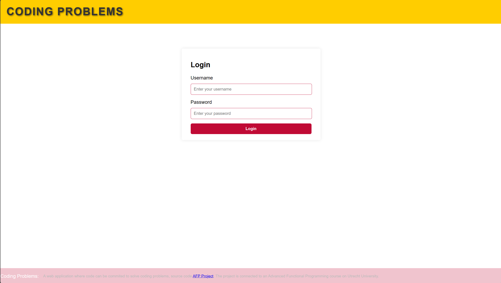
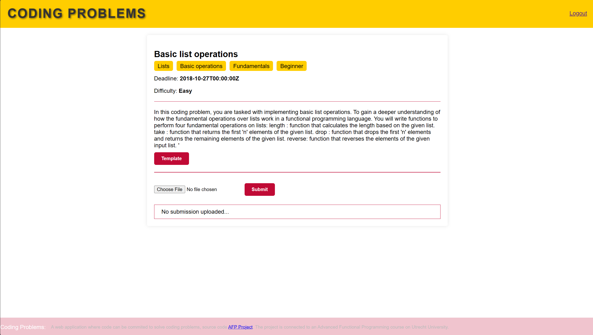

# Code Commit

A web application where code can be commited to solve coding problems. 
Code is being checked and ran to verify its correctness and performance. 
The project is connected to an Advanced Functional Programming course on Utrecht University. 

## Requirements

- cabal     3.10.2.1
- ghc       9.4.8
- elm       0.19.1
- docker >= 4.19

### Build/Run Steps

Run database:
`docker-compose up database`

Run the front-end:
`./front-end/server.sh`

Run back-end: 
`cd server && cabal run`

## Outline of Project

### Interface
The current version of the web application contains a login and coding problem interface.

#### Login

#### Coding problem

### Security

The security is managed via Json Web Tokens. Users can login and receive ( and update) their access token and refresh tokens.
Authorized endpoints require the user to have a valid token in their _Authorization_ header.

### Endpoints

* Authorization:
  * POST _/login_  
    Returns access and refresh token iff valid login credentials.
  * POST _/refresh_  
    Returns fresh access token and the refresh token iff valid refresh token.
  * GET _/user_ (Protected)
    Returns the user's information.
* Coding Problems
  * GET _/coding-problems_  
  Returns a list of all existing coding problem.
  * GET _/coding-problems/:id_  
  Returns coding problem with _id_ iff it exists.
  * POST _/coding-problems/:id/attempts_ (Protected)
  Endpoint a user can submit his code attempt to.
  * GET /coding-problems/:id/attempts (Protected) 
  Endpoint a user can call to retrieve all their attempts
